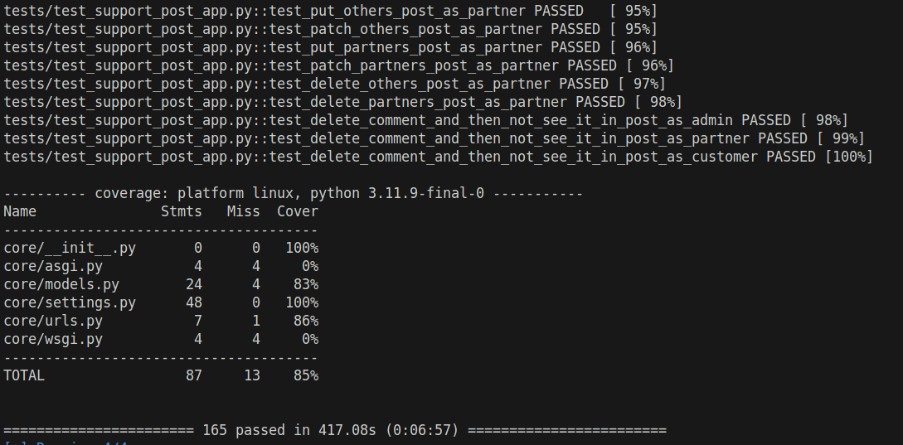

# 🥤 DrinkJoy Project | Backend side


The DrinkJoy project aims to address the challenge faced by restaurants and cafes during off-peak hours by implementing a subscription-based model for free beverages. This initiative increases foot traffic and revenue for participating businesses.


## 📋 Features

- **User Roles**: Three main roles - customer, partner, admin.
- **Soft Delete**: This feature introduces a BaseModel class with a soft delete functionality, which allows models to be marked as deleted without physically removing them from the database.
- **API Endpoints**: RESTful API for managing orders, establishments, subscriptions and support with role-based access control.
- **Pytests**: To maintain the robustness of the application by catching bugs early and ensuring that new changes do not break existing functionalities.
- **Github Actions**: Continuous integration and deployment setup using GitHub Actions.
- **Pre-commit**: Automated checks to ensure code quality and consistency before committing changes.

## 📑 Project structure
- **Accounts**: Manages user registration, profile management, password changes, logout, and partner-specific operations (listing, creating, blocking, and unblocking partners). Admin permissions are required for user listing and partner-related actions, while other views require general user authentication.
- **Core**: Contains the project's settings and configurations.
- **Establishments**: Manages endpoints for listing, creating, updating, and deleting establishments and their banners, with specific permissions for partners and authenticated users.
- **Menu**: Handles endpoints for listing, creating, updating, and deleting categories, menus, and beverages with specific permissions for admins and partners.
- **Orders**: Manages endpoints for listing, creating, updating, and retrieving orders and customer information, with specific permissions for partners and customers. Provides order statistics for partners based on various timeframes.
- **Support**: Handles endpoints for listing, creating, updating, and deleting posts and comments with specific permissions to ensure only the authors can modify or delete their own content.
- **Subscriptions**: Manages endpoints for product and subscription creation, retrieval, updates, and deletions on both the platform and PayPal, with specific permissions for admin users and general accessibility for others.
- **Tests**: Contains pytests for the project.
- **Fixtures**: Contains initial data fixtures for populating the database.

## 🛠️ Technologies and Libraries


## 🏁 Getting Started
These instructions will guide you through setting up the project on your local machine.

### Prerequisites
- Python 3.x
- Pip
- Virtualenv or Poetry (optional but recommended)
- DjangoRestFramework
- Docker
- PostgreSQL

## 🔌 Installation

### Setting Up a Virtual Environment
1. **Clone the repository:**

    ```bash
    git clone git@github.com:Reviro-Spring-TechStart2024-T1/backend.git
    ```

2. **Set up and activate a virtual environment:**

    Creating a virtual environment is recommended to keep dependencies required by different projects separate.

    - Install virtualenv if you haven't installed it yet:

        ```bash
        pip install virtualenv
        ```

    - Create a virtual environment in the project directory:

        ```bash
        virtualenv venv
        ```

    - Activate the virtual environment:

        - On Windows:
            ```bash
            venv\Scripts\activate
            ```
        - On Unix or MacOS:
            ```bash
            source venv/bin/activate
            ```

3. **Install dependencies:**

    With the virtual environment activated, install the project dependencies:

    ```bash
    pip install -r requirements.txt
    ```

4. **Set up environment variables:**

    Copy the `.env.example` to `.env` and fill in the necessary values.

5. **Configure the PostgreSQL database:**

    Ensure you have PostgreSQL installed and running. Create a database for this project and configure the database settings in your project's `settings.py` file.

6. **Perform database migrations:**

    Apply migrations to set up your database schema:

    ```bash
    python manage.py migrate
    ```

7. **Create a superuser:**

    Create a superuser for Django's admin panel with the following command:

    ```bash
    python manage.py createsuperuser
    ```

    Follow the prompts to set up the username, email, and password for the superuser.

8. **Run the project:**

    Start the Django development server:

    ```bash
    python manage.py runserver
    ```

    The project will be available at `http://127.0.0.1:8000/`.

### ⛴️ Using Docker
1. **Build and start the Docker containers:**

    ```bash
    docker-compose up --build
    ```

2. **Access the application:**

    The application will be running at [http://localhost:8000](http://localhost:8000).


3. **Running pytests via Docker**
    - In the directory where the repository was cloned enter following command:
    - For Linux/MacOS:

    ```
    docker compose -f compose.test.yaml up -d && docker logs --follow test_web && docker compose -f compose.test.yaml down -v
    ```

    - For Windows:

    ```
    docker compose -f compose.test.yaml up -d; docker logs --follow test_web; docker compose -f compose.test.yaml down -v
    ```

    - Command will run 165 unit tests and show them in terminal. At the end you should see something like this:
    


### Production
For production, use Gunicorn to run the application. Ensure the necessary environment variables are set, then use the following command to start the server:
```bash
gunicorn core.wsgi:application -w 4 -b 0.0.0.0:8000
```
## Docker Files

### Dockerfile
```Dockerfile
FROM python:3.11-slim

ENV PYTHONUNBUFFERED=1 \
    PYTHONDONTWRITEBYTECODE=1 \
    APP_HOME=/app

WORKDIR $APP_HOME

COPY ./requirements.txt .
RUN pip install --upgrade pip
RUN pip install --no-cache-dir -r requirements.txt

COPY . .

EXPOSE 8000
```
### docker-compose.yml
```
version: "3.9"

services:
  db:
    image: postgres:latest
    restart: always
    env_file:
      - .env
    volumes:
      - "./postgres:/var/lib/postgresql/data"

  app:
    build: .
    volumes:
      - .:/core
      - ./static:/app/static
    ports:
      - "8000:8000"
    command: >
      bash -c "python manage.py collectstatic --no-input &&
               python manage.py makemigrations &&
               python manage.py migrate &&
               python manage.py loaddata fixtures/users.json --app accounts.User &&
               python manage.py loaddata fixtures/categories.json --app menu.Category &&
               gunicorn core.wsgi:application -w 4 -b 0.0.0.0:8000"

    env_file:
      - .env
    depends_on:
      - db
```
#  ⓘ Additional Information
 - #### Testing: To run tests, use the following command:
```bash
pytest tests
```
 - #### Linting: To lint your code, use:
```bash
pre-commit run --all-files
```
 - #### Deployment: Detailed deployment instructions will vary depending on your environment but generally involve pushing your Docker image to a container registry and deploying it to a server or cloud service that can run Docker containers.

# 💾 Environment Variables
### Ensure you fill in the required environment variables in the .env file:
```text
SECRET_KEY=
DEBUG=
DRINKJOY_EMAIL_USER=
DRINKJOY_EMAIL_PASSWORD=
CLOUD_NAME=
CLOUD_API_KEY=
CLOUD_API_SECRET=
POSTGRES_DB=
POSTGRES_USER=
POSTGRES_PASSWORD=
POSTGRES_HOST=
POSTGRES_PORT=
POSTGRES_HOST_AUTH_METHOD=
ALLOWED_HOSTS=
```

# 🌐 API Documentation and Testing
## 📗 Swagger UI
The project utilizes drf-spectacular for generating real-time API documentation using Swagger UI. This documentation provides a clear overview of all available API endpoints, their expected parameters, and response formats. Additionally, you can directly interact with the API through the Swagger UI to test endpoints.

To access the Swagger UI:

Ensure the project is running by following the Installation and Running the server instructions.
Navigate to /api/docs/ in your web browser. Example: http://127.0.0.1:8000/docs/
Here, you'll find a list of all API endpoints grouped by model. You can expand each endpoint to see detailed information and perform test requests directly from your browser.

## 🧪 Testing API Endpoints
## Using Swagger UI
Go to the Swagger UI page as described above.
Find the endpoint you wish to test and click on it to expand the section.
If required, click the "Try it out" button.
Enter any necessary parameters.
Click the "Execute" button to send a request to the API.
The response, including status code and payload, will be displayed directly in the UI.
